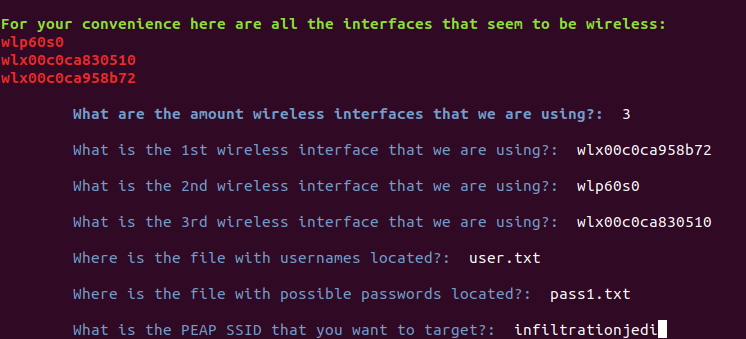
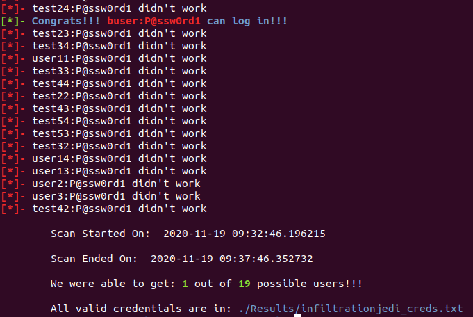

# Peap_Bomb
<p align="center">
  
</p>

Peap Bomb is a password sprayer for WPA/WPA2 enterprise wireless that is leveraging PEAP for Authentication. 

<p align="center">
  
</p>

## Setup
```
sudo apt install wpasupplicant
```

You should then restart your device!!!

Connect up to 6 Wireless adapters to your device. 


## Running 
1. Create a users list. NOTE: Most environments have account lockouts, Each user will take about 20 seconds to test a password on, if your user list is small or if you are using 6 adapters on a medium sized list you might lock accounts out. 
2. Create a potential password list. NOTE: This can be a large as you want, however the bigger it is the longer it will take for Peap Bomb to finish. 
3. Peap Bomb can currently support up to 12 wireless interfaces at once.

```
sudo python3 peapbomb.py
```
<p align="left">
  
</p>

As you can see above we give you an assumed list of wireless interfaces. Once you put in all the information Peap Bomb will start!

## Seeing Results 
The results should be easy to see. 
<p align="left">
  
</p>


**ENJOY!!** :sunglasses:

[](http://www.youtube.com/watch?v=09DbGZMJJmU "Example PEAP_BOMB")
